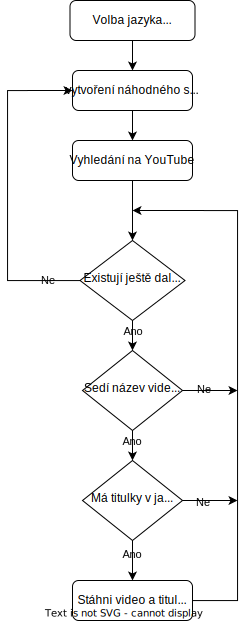

# YouTube_video_downloader
## Tvorba trénovacích dat pro strojové učení ze záznamů na Youtube

## Titulní strana

## Zadání

## Úvod
Cílem mé práce bylo provést studii proveditelnost pro aplikaci, jenž by automaticky stahovala videa s titulky z webové platformy YouTube. 

Aplikace má stahovat videa dle volby poptávaného jazyka. A to tak, že pokud možno rychle a s co nejvyšší shodou jazyka záznamu a titulků. Účelem výsledné aplikace je vytěžování audio dat s přepisem řeči pro další využití v úlohách strojového učení, jako jsou rozpoznání slov a automatický převod řeči na text. V těchto úlohách je žádoucí mít co nejvíce trénovacích dat. YouTube je jednou z největších volně přístupných databází videí a značné procento z nich má dokonce autorem vytvořené titulky. Vzhledem k těmto charakteristikám se YouTube stal vhodným kandidátem pro zdroj surových dat.

Má práce spočívala ve vytvoření programu, který po konfiguraci a zadání jazyka začne prohledávat Youtube a stahovat všechna vhodná videa. Mezi klíčové problémy, které jsem při vývoji musel překonat spadalo: 
- vyhledávání videí v požadovaném jazyce
- odhadnutí jazyka videa pro prvotní kontrolu
- selekce nahrávek bez titulků v požadovaném jazyce
- stáhnutí videa a titulků
- převod videa na pouhý audio záznam

## Využité nástroje:
### Metody TDD & extrémního programování
Testy řízené programování. Zde bylo využito knihovny [pytest](#pytest). Ve výsledku je aplikace pokryta testy pouze z nějakých 30%. To sice není mnoho, ale testují se základní funkce a logika aplikace. Pro větší pokrytí by bylo potřeba vytvoření mock tříd pro integrační testy komunikace programu s YouTube.

### TUI - terminal user interface
Aplikace je vybavená konzolovým aplikační rozhraní. Parsovaná přepínačů je zprostředkováno knihovnou [argparse](#argparse), která umožňuje zadávání argumentů v libovolném pořadí a automaticky generuje help výpis.

### Více vláknové programování
Aplikace využívá rozdělení do více vláken za pomocí standardního modulu [threading](#threading). V hlavním vláknu programu je řešeno čtení z konzole ("q" pro ukončení aplikace). Worker thread řeší veškerou zbylou logiku programu.

### Vyhledávání videí
Pro vyhledávání videí byla použita knihovna [youtubesearchpython](#youtubesearchpython). Velkou výhodou využití této knihovny oproti parsování informací přímo z YouTube je možnost listování na další stránky výsledků, které je na stránkách dnes řešeno pomocí responzivního webu, které je takřka nemožné obejít pomocí jednoduchého web crawleru. 

### Detekce jazyka
Jazyk z jednotlivých textů aplikace rozpoznává s využitím modulu [langdetect](#langdetect). Jeho velkou výhodou je jednoduché použití. Pro detekci jazyka stačí zavolat funkci `langdetect.detect_langs(text)` a ta vrátí list všech možných detekovaných jazyků s procentuální pravděpodobností.

### Práce s titulky
Po experimentování s několika knihovnami určenými pro práci s YouTube titulky vyvstala knihovna [youtube_transcript_api](#youtube_transcript_api) jako ideální volba. Zejména díky snadnému dotazování na seznam jazyků použitých titulků a možnost stáhnutí dat jak ve formátu s časovou značkou, tak i čistě jako pouhý text. V obou případech je výstup uložen do souboru .txt (prostý text). Zde jiné knihovny umožňovali uložení pouze v proprietárních formátech, jenž byli vyhodnoceny jako nevhodné s ohledem pro další zpracování. 

### Stahování videí
To je zajištěno funkcionalitami v modulu [yt_dlp](#yt_dlp). Původně byl vnitřní algoritmus aplikace postaven na knihovně [youtube-dl](https://github.com/ytdl-org/youtube-dl), ale YouTube nejspíše nebyl smířen s jejím velkým rozšířením pro automatické stahování videí a proto zavedl opatření, která omezila rychlost stahování na ~300kbps, která je pro získávaní velkého objemu dat naprosto nepoužitelná. Tento problém naštěstí obchází výše zmíněná knihovna yt_dlp a díky tomu že je forkem youtube-dl (vychází z jejích zdrojových kódů), tak se při přechodu ani nemění aplikační interface a je možné použít všechny funkce tak jako by se jednalo o původní knihovnu. 
Knihovna také umožňuje převedení formátu videa po dokončení jeho stahování. Aplikace je tak může hned po uložení automaticky převést do formátu .wav.  

## Postup řešení
### Řešení v Bashi
Zprvu byl pro řešení zvolen skriptovací jazyk Bash. Ten má mnoho výhod, umožňuje volat konzolové programy, jako kdyby to byli jeho funkce a díky tomu lze snadno získat pokročilé možnosti. Mezi ně například patří stažení videa či audia pomocí programu youtube-dl zapsaného na jeden řádek. V Bashi je také snadné vytvořit vysoce paralelní aplikaci pomocí spouštění podprocesů řešící jednotlivé dílčí úkony. Velmi lehká je také práce s adresáři a soubory, jelikož základní příkazová výbava Bashe je tvořena nástroji pro ovládání počítače z terminálu, což obnáší pohyb adresářovou strukturou, mazání a vytváření souborů, jejich výpis a další. 

Při návrhu algoritmu bylo provedeno rozhodnutí rozdělit problém na dvě části:
Nejprve prohledat YouTube a vytvořit databázi o co největším počtu záznamů, které by tvořil formát:
- id videa
- id kanálu
- název videa
- jazyk videa
- seznam jazyků dostupných titulků
- A ve poslední řadě také záznam o všech našeptávaných videích na stejné stránce.

A ve druhém kroku napsat ještě jiný program, který by po zadání již specifického jazyka databázi prohledal a stáhl všechna uložená videa která splní kriteria (videa s titulky).
Výhodou tohoto řešení by bylo opakované využití záznamů z prvního kroku pro hledání různých jazyků.

Při implementaci nastalo rovnou několik nečekaný problémů:
1. při analýze dat

Když byl dokončen kód k prohledávání YouTube a ukládání záznamů o 
videích. A část skriptů pro práci s youtube-dl byla rozpracována do takové úrovně, že se již podařilo stahovat jak záznam videa převedeného do formátu .wav, tak i titulky. 
Program byl nechán běžet přes víkend a zvládl stáhnout něco přes 200k záznamů. Při jejich podrobnějším prozkoumání byl zvolen jazyk Čeština pro snadnou validaci dat. Počet vyfiltrovaných videí splňujících kriterium českých titulek byl přibližně ~350, to se nejevilo zas tak zle, jenže u žádného z nich se nevyskytoval český název, co více, tak naprostá většina z nich měla názvy v úplně cizích abecedách. 
Co říci, do algoritmu byla vložena větší naději na úspěch. Problém byl patrně v tom, že youtube algoritmus si pamatoval všechna předchozí dotazování a při prohledávání do hloubky, padal čím dál tím víc do zaječí nory. 

2. problém byl i při samotném běhu programu

Dotazování na servery YouTubu vytěžovalo počítač více, než byl prvotní předpoklad. Tím důvodem se patrně stal zvolený programovací jazyk, který nikdy nebyl zamýšlen pro časově kritické úkoly a tak interpretovaný Bash byl prostě pro danou úlohu příliš pomalý a paměťově náročný.

Pod tíhou dosavadních výsledků a s vyplýtvanou více než polovinou časové dotace pro řešení úkolu bylo učiněno nelehké rozhodnutí. A to opustit dosavadní práci a začít sice od znova, avšak vydat se naprosto jinou cestou, jenž se snad, jak se ukáže s odstupem času, také nebude jevit slepou.

### Řešení v Pythonu
Vzhledem k tomu, že předchozí řešení nepřineslo uspokojivé výsledky, byl nový zvolený směr založen na změně programovacího jazyka, přechod na Python, a také změně přístupu. Místo vytvoření databáze videí s titulky stejně tak jako bez titulků určené pro další filtrování, bylo rozhodnuto dát velký důraz na seed vyhledávání. Nový algoritmus si kladl za cíl nejdříve vytvořit dotaz v kýženém jazyce a poté vyselektovat všechny videa s titulky a ty stáhnout.

Podrobný postup algoritmu:


1. Vytvoření dotazu

Nejprve se vytvoří dotaz. Ten se skládá z několika (3, lze zvolit) náhodně vybraných slov z word listu. To by mělo prioritizovat výsledky v daném jazyce.

2. Vyhledávání videí v požadovaném jazyce

Dotaz se na YouTube odesílá pomocí knihovny youtubesearchpython. Program se doptává na další a další nalezený videa, dokud nejsou všechna večerpána, nebo program nenarazí na iterační strop. 

3. detekce jazyka

Po získání id videa se lze dotázat na jeho další vlastnosti. Mezi ně patří:
- id videa
- id kanálu
- název videa
- klíčová slova
- jazyky dostupných titulků

Algoritmus detekuje jazyk na základě názvu. 

4. selekce nahrávek bez titulků v požadovaném jazyce

Pokud jsou pro jazyk nalezeny titulky, tak se přistoupí ke stahování.

6. stažení videa a titulků

Posledním krokem algoritmu je stažení videa a jeho převod do formátu .wav (audio) a stažení titulků do plain textu. 

Aplikace je naprogramovaná s využitím více vláken. Jedno vlákno se stará čistě jen o vstup z klávesnice a druhý řeší zbytek (stahování z YouTube).

## Uživatelský manuál
### Instalace
Zdrojové kódy je možné stáhnout z GitHub repozitáře [zde](https://github.com/elPytel/YouTube_video_downloader). Pro instalaci na Linuxových strojích lze využít Bashový script uložený v adresáři Python. Po jeho spuštění se nainstalují všechny potřebné knihovny pro spuštění programu napsaného v jazyce Python.
### Ovládání
Aplikace disponuje pouze terminálovým rozhraním. Jednotlivé volby programu se zadávají pomocí přepínačů při spuštění. Jejich zpracování je provedeno pomocí standardního modulu **argparse**, díky tomu je vstup poměrně robustní a nezáleží na pořadí zadaných přepínačů. Ovládání aplikace je v jazyce Angličtina.
Výpis z konzole pro volbu *-h* "help":
```Bash
$ python3 main.py -h
usage: main.py [-h] [-l LANGUAGE] [-w WORDS] [-i ITERATIONS] [-v]
               [-d]

Youtube video & subtitles downloader.

options:
  -h, --help            show this help message and exit
  -l LANGUAGE, --language LANGUAGE
                        select language
  -w WORDS, --words WORDS
                        Set number of generated words.
  -i ITERATIONS, --iterations ITERATIONS
                        Number of tested iterations for query
  -v, --verbose         Increase verbosity.
  -d, --debug           Run debug options.
```

Příklad spuštění v základní konfiguraci a s volbou českého jazyka (soubor main.py se nachází v adresáři **Python/**):
```Bash
$ python3 main.py -l CS
```

Pokročilá volba s angličtinou:
```Bash
$ python3 main.py -v -d -l EN -w 4 -i 100
```
Provede se nastavení: 
- ***verbose*** pro podrobnější výpisy do konzole
- ***debug*** přidání debugovacích hlášení
- ***EN*** pro vyhledávání se zvolí angličtina
- ***words***, počet náhodně vygenerovaných slov bude 4
- ***iterations***, počet vyhodnocených výsledků každého dotazu bude 100

Vzorový výstup do konzole:
```Bash
Searched words:
nechejme jednotne mizera
Quering initial search.
Search does not have more videos.
Searched words:
hojil lišena vzbouřen
Quering initial search.
1 - Video: 
Title: George Orwell-Farma zvířat(CZ titulky)-animovaný film 
Duration: 1:09:27        
ID: 5kVPz2_GEbc
id:              Language:       Code:   Generated:
5kVPz2_GEbc      Čeština         cs      False

Got:  Czech
Downloading video...
Done downloading, now converting ...
Downloading transcript...
Downloading is finished.
```

### Další jazyky
Jazyk se vybírá pomocí dvoupísmenného kódu ISO 639-1. Seznam kódů k jednotlivým jazykům: [zde](https://www.science.co.il/language/Codes.php). Pro přidání dalšího jazyka do aplikace je zapotřebí stáhnout wordlist ve formátů .txt a kódování UTF-8, ze kterého se budou generovat náhodná slovní spojení a ten uložit do adresáře **dict/**. Dále je potřeba aktualizovat konfigurační soubor **Python/languages.json**.

Vzorový záznam:
```JSON
{
	"CS": {
		"title": "Czech",
		"code": "cs",
		"file_name": "czech.txt"
	}
}
```
- **CS** je klíč pro volbu jazyka
- **title** je vypisovaný název
- **code** je zkratka jazyka dle ISO 639-1 normy
- **file_name** je soubor s word listem

## Analýza výsledků
Postup vyhodnocování výsledků programu byl: 
1. Zvolit jazyky k vyhledání
2. Stáhnout statisticky významné množství dat
3. Otestovat shodu jazyka videa a titulků

Zvolené jazyky byli Čeština, Slovenština, Angličtina a pro otestování ve zjednodušené míře také Norština. První tři byli vybrány z důvodu jednoduchého testování výsledků. Data byla testována na shodu jazyka názvu videa, obsahu, titulek a zda odpovídá obsah vůči titulkům. 

Plný obsah znění tabulek je uveden v [příloze](##přílohy).

Tabulka shrnutí analyzovaných dat:
| Jazyk | Počet | Název v jazyce | Video v jazyce | Titutulky v jazyce | Shoda |
| --- | --- | --- | --- | --- | --- |
| EN | 36 | 100,00% | 91,89% | 94,59% | 89,19% |
| CS | 54 | 100,00% | 31,58% | 96,49% | 31,58% | 
| SK | 36 | 51,35% | 35,14% | 100,00% | 27,03% |

Jak se zprvu předpokládalo, tak pro jazyk Angličtina vychází přesnost zdaleka nejvyšší. Je to díky jeho celosvětovému rozšíření a prakticky největšímu množství nahrávek na YouTube. Nejčetnější chybou byl pro tento jazyk minimální obsah mluveného slova a tedy prakticky nulový obsah titulek.

Algoritmus na češtině dosáhl úspěšnosti 31,5% při 56 kontrolovaných záznamech, což je prakticky každý třetí soubor. To není nikterak špatné s ohledem na použité technologie. Největší zastoupenou chybou zde byl výskyt sice českého názvu videa, ale jeho obsah v naprosto jiném jazyce (Angličtina / Ruština). Klíčovým krokem algoritmu je určení řeči videa na základě detekovaného jazyka názvu. V takových to případech algoritmus nutně selhává. Prakticky každé stažené video v češtině s titulky mělo též obsahovou shodu v záznamu a titulkách. 

Stáhnout 30 českých vidí trvalo přibližně hodinu, z toho plyne že očekávatelný čas potřebný pro nalezení a stažení jednoho videa jsou v 2 minuty. 

Pro Slovenštinu byl naneštěstí zvolen nevhodný word list, který obsahoval pouze slova bez diakritiky. To spolu s dalšími vlivy vedlo na to, že prakticky polovina názvů nalezených videí byla v Češtině na místo Slovenštiny. Vyhledávaní vhodných videi bylo ve srovnání, například s Češtinou, lehce pomalejší. 

Často se v příkladech kdy nesedí jazyk videa k jeho názvu objevují strojově generované titulky, které nejsou příliš dobré a jejich existence rozhodování algoritmu mátla.

## Závěr
V rámci mé práce jsem dospěl k závěru, že YouTube jako zdroj dat pro vytěžování lze použít. A to za předpokladu, že za touto aplikací, bude ještě sedět člověk, který provede finální verifikaci, zda jsou data dobře rozpoznaná. Oproti jinému přístupu přináší tu výhodu, že člověku odpadá práce s vyhledáváním videí a jejich manuální převod do žádaného formátu. U aplikace také lze očekávat, že čím více je hledaný jazyk rozšířen, tím vyšší bude nejen rychlost hledání videí, ale i úspěšnost jejich automatické anotace. 

### Možné rozšíření do budoucna
Přidání detekce jazyka ze zvukové stopy. Grafická nadstavba konzole. Vícevláknová implementace části kódu dedikovaného pro stahování a zpracování videí pro urychlení běhu kódu na vícevláknových platformách. Možnost upravit hranici rozpoznání na bázi jednotlivých jazyků.

## Zdroje
Při programování jsem čerpal z oficiální dokumentace jednotlivých Pythonovských modulů, jejich příslušných GitHubových repozitářů a StackOverflow.
Použité knihovny:
- <a name="pytest"></a>[pytest](https://pypi.org/project/pytest/)
- <a name="argparse"></a>[argparse](https://pypi.org/project/argparse/)
- <a name="threading"></a>[threading](https://docs.python.org/3/library/threading.html)
- <a name="youtubesearchpython"></a>[youtubesearchpython](https://pypi.org/project/youtube-search-python/)
- <a name="langdetect"></a>[langdetect](https://pypi.org/project/langdetect/)
- <a name="youtube_transcript_api"></a>[youtube_transcript_api](https://pypi.org/project/youtube-transcript-api/)
- <a name="yt_dlp"></a>[yt_dlp](https://pypi.org/project/yt-dlp/)

## Přílohy
- [Tabulka analýza CZ](https://htmlpreview.github.io/?https://github.com/elPytel/YouTube_video_downloader/blob/main/docs/CS.html)
- [Tabulka analýza SK](https://htmlpreview.github.io/?https://github.com/elPytel/YouTube_video_downloader/blob/main/docs/SK.html)
- [Tabulka analýza EN](https://htmlpreview.github.io/?https://github.com/elPytel/YouTube_video_downloader/blob/main/docs/EN.html)
